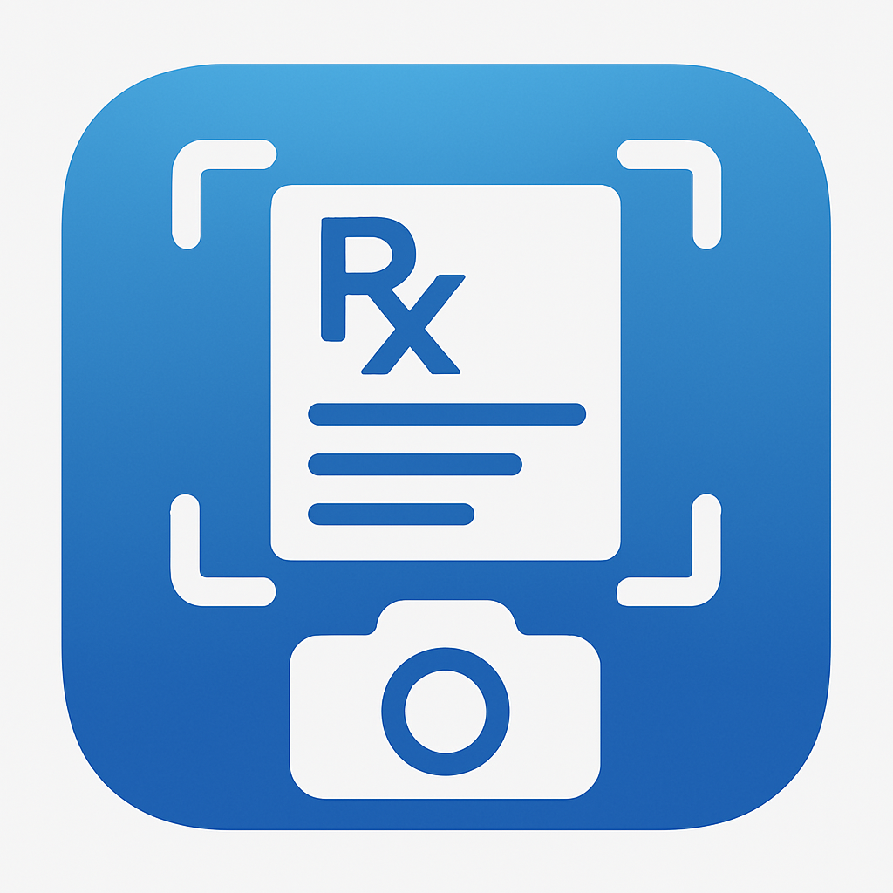

# Prescription Scanner App

<p align="center">
  
</p>

## 📱 Overview

Prescription Scanner is a Flutter mobile application that helps users scan and analyze their medical prescriptions. The app uses image processing and machine learning to identify medications, dosages, and instructions from a prescription image, making it easier for patients to understand and manage their medications.

## ✨ Features

- **Easy Prescription Scanning**: Capture clear images of prescriptions using your device camera
- **Medication Recognition**: Automatically identifies medications on the prescription
- **Detailed Information**: Shows dosage, frequency, and duration for each identified medication
- **User-Friendly Interface**: Simple, intuitive design with guided camera alignment
- **Information Lookup**: View detailed information about identified medications

## 🛠️ Technologies

- **Flutter**: Cross-platform UI toolkit for building natively compiled applications
- **Camera**: Flutter plugin for accessing device cameras
- **Google ML Kit**: On-device machine learning for text recognition
- **TensorFlow Lite**: Lightweight solution for mobile machine learning
- **Provider**: State management solution
- **Path Provider**: File system access for temporary image storage

## 📷 Screenshots

<p align="center">
  
  
  
</p>

## 🚀 Getting Started

### Prerequisites

- Flutter SDK (2.5.0 or higher)
- Android Studio / VS Code
- Android SDK version 21 or higher (for Android)
- iOS 12.0 or higher (for iOS)

### Installation

1. Clone the repository:
   ```
   git clone https://github.com/yourusername/prescription_scanner.git
   ```

2. Navigate to project directory:
   ```
   cd prescription_scanner
   ```

3. Install dependencies:
   ```
   flutter pub get
   ```

4. Run the app:
   ```
   flutter run
   ```

## 📋 How It Works

1. **Welcome Screen**: Introduces the app and its purpose
2. **Camera Screen**: Aligns prescription within the dotted border and captures the image
3. **Processing**: Analyzes the prescription using ML Kit for text recognition and TensorFlow Lite for medication identification
4. **Results Screen**: Displays identified medications with details including name, dosage, frequency, and duration
5. **Information**: Provides access to more detailed information about each identified medication

## 🔧 Project Structure

- **lib/**
  - **core/**: Core functionality and dependency injection
  - **features/**: Feature-based modules (welcome, camera, results screens)
  - **services/**: Business logic (camera and ML services)
  - **shared/**: Shared models, widgets, and utilities
  - **main.dart**: Application entry point

## 🔮 Future Improvements

- Offline medication database
- Medication reminders and scheduling
- Integration with pharmacy services
- Multiple language support
- Prescription history and tracking

## 📄 License

This project is licensed under the MIT License - see the LICENSE file for details.

## 🤝 Contributing

Contributions are welcome! Please feel free to submit a Pull Request.

## 👨‍💻 Author

- Your Name - [GitHub Profile](https://github.com/yourusername)

---

<p align="center">Made with ❤️ using Flutter</p>
